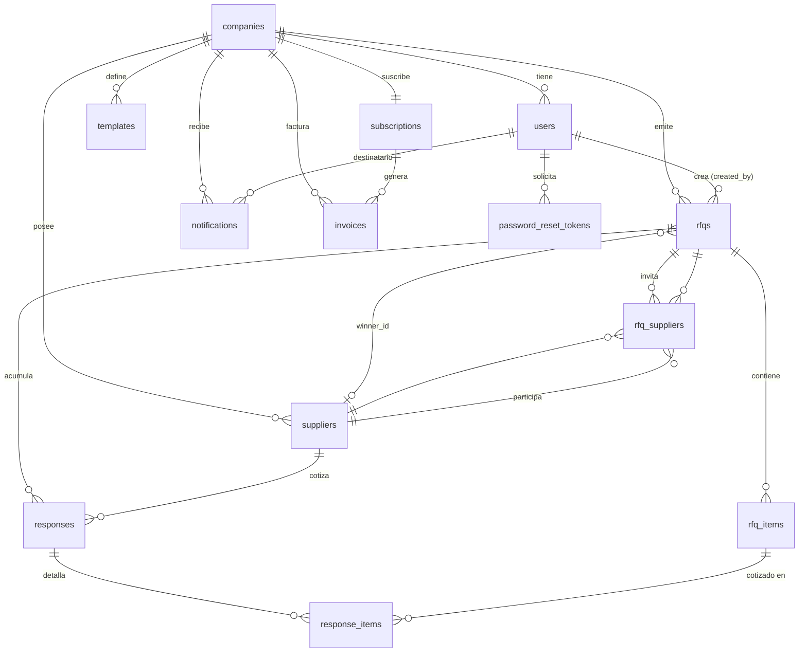

# Back-Schema — CotizaMe: Modelo de Datos del Backend

**Versión:** 1.0
**Fecha:** 2026-07-22
**Estado:** Derivado de `planing/TRD.md` §4 (fuente técnica canónica)
**Motor:** PostgreSQL 16 · ORM SQLAlchemy 2 (async) · Migraciones Alembic
**Referencia:** `planing/TRD.md`, `planing/PRD.md` §8, `planing/app-flow.md`

> Este documento describe **cómo se organiza la data**: entidades, columnas,
> tipos, constraints, relaciones e índices. Es la especificación de referencia
> para los `model.py` (SQLAlchemy) y las migraciones Alembic de cada módulo.
> Ante cualquier discrepancia con `TRD.md` §4, este documento la resuelve y el
> TRD debe actualizarse.

---

## 1. Convenciones Globales

Todas las tablas de negocio respetan estas reglas. Se implementan como **mixins**
reutilizables de SQLAlchemy para evitar repetición.

| Convención        | Regla                                                                     | Mixin              |
| ----------------- | ------------------------------------------------------------------------- | ------------------ |
| Clave primaria    | `id UUID PRIMARY KEY DEFAULT gen_random_uuid()`                           | `UUIDMixin`        |
| Timestamps        | `created_at`, `updated_at` → `TIMESTAMPTZ NOT NULL DEFAULT now()`         | `TimestampMixin`   |
| Soft delete       | `deleted_at TIMESTAMPTZ` (nullable); se filtra `deleted_at IS NULL`       | `SoftDeleteMixin`  |
| Multi-tenant      | `company_id UUID NOT NULL REFERENCES companies(id)` en tablas de negocio  | `TenantMixin`      |
| Nombres           | `snake_case` para tablas (plural) y columnas                              | —                  |
| Zona horaria      | Todo timestamp se guarda en **UTC** (`TIMESTAMPTZ`); se presenta con TZ de la empresa | —      |

**Notas de implementación:**

- `gen_random_uuid()` requiere la extensión `pgcrypto` (Postgres 13+ la trae en `public`). La primera migración ejecuta `CREATE EXTENSION IF NOT EXISTS pgcrypto;`.
- `updated_at` se actualiza vía `onupdate=func.now()` en el ORM (no trigger de BD en MVP).
- **Soft delete estricto:** nunca `DROP TABLE`/`DROP COLUMN` en producción (ver `TRD.md` §9). Las tablas puente y de detalle usan `ON DELETE CASCADE` porque su ciclo de vida está atado al padre y no requieren auditoría independiente.

---

## 2. Diagrama Entidad-Relación



**Leyenda de cardinalidad:** `||` = uno · `o{` = cero o muchos · `|{` = uno o muchos · `o|` = cero o uno.

---

## 3. Mapa de Relaciones (resumen)

| Origen                     | Destino          | Tipo   | FK                              | On Delete   |
| -------------------------- | ---------------- | ------ | ------------------------------- | ----------- |
| `users`                    | `companies`      | N:1    | `users.company_id`              | RESTRICT    |
| `password_reset_tokens`    | `users`          | N:1    | `password_reset_tokens.user_id` | CASCADE     |
| `suppliers`                | `companies`      | N:1    | `suppliers.company_id`          | RESTRICT    |
| `rfqs`                     | `companies`      | N:1    | `rfqs.company_id`               | RESTRICT    |
| `rfqs`                     | `users`          | N:1    | `rfqs.created_by`               | RESTRICT    |
| `rfqs`                     | `suppliers`      | N:1?   | `rfqs.winner_id` (nullable)     | SET NULL    |
| `rfq_items`                | `rfqs`           | N:1    | `rfq_items.rfq_id`              | CASCADE     |
| `rfq_suppliers`            | `rfqs`           | N:1    | `rfq_suppliers.rfq_id`          | CASCADE     |
| `rfq_suppliers`            | `suppliers`      | N:1    | `rfq_suppliers.supplier_id`     | RESTRICT    |
| `responses`                | `rfqs`           | N:1    | `responses.rfq_id`              | CASCADE     |
| `responses`                | `suppliers`      | N:1    | `responses.supplier_id`         | RESTRICT    |
| `response_items`           | `responses`      | N:1    | `response_items.response_id`    | CASCADE     |
| `response_items`           | `rfq_items`      | N:1    | `response_items.rfq_item_id`    | RESTRICT    |
| `templates`                | `companies`      | N:1    | `templates.company_id`          | RESTRICT    |
| `notifications`            | `companies`      | N:1    | `notifications.company_id`      | CASCADE     |
| `notifications`            | `users`          | N:1?   | `notifications.user_id`         | CASCADE     |
| `subscriptions`            | `companies`      | 1:1    | `subscriptions.company_id`      | RESTRICT    |
| `invoices`                 | `companies`      | N:1    | `invoices.company_id`           | RESTRICT    |
| `invoices`                 | `subscriptions`  | N:1?   | `invoices.subscription_id`      | SET NULL    |

> `RESTRICT` protege registros con historial (auditoría); `CASCADE` se reserva
> para hijos cuyo ciclo de vida depende del padre; `SET NULL` para referencias
> opcionales que no deben bloquear el borrado.

`rfq_suppliers` es la **tabla puente** (junction) de la relación M:N entre `rfqs` y `suppliers`, con datos propios (token, estado de envío, timestamps).

---

## 4. Tablas por Módulo

Los módulos siguen la estructura Clean Architecture de `TRD.md` §3.1. La columna
**Fase** indica cuándo se crea la migración.

| Módulo          | Tablas                                             | Fase |
| --------------- | -------------------------------------------------- | ---- |
| `companies`     | `companies`                                        | MVP  |
| `users`         | `users`, `password_reset_tokens`                   | MVP  |
| `suppliers`     | `suppliers`                                        | MVP  |
| `rfq`           | `rfqs`, `rfq_items`, `rfq_suppliers`               | MVP  |
| `responses`     | `responses`, `response_items`                      | MVP  |
| `templates`     | `templates`                                        | V2   |
| `notifications` | `notifications`                                    | V2   |
| `billing`       | `subscriptions`, `invoices`                        | V2   |

---

### 4.1 `companies` — Tenant raíz

Entidad raíz del modelo multi-tenant. Toda tabla de negocio cuelga (directa o
indirectamente) de una `company`.

| Columna           | Tipo           | Constraints / Default                      | Descripción                          |
| ----------------- | -------------- | ------------------------------------------ | ------------------------------------ |
| `id`              | `UUID`         | PK, `DEFAULT gen_random_uuid()`            | Identificador del tenant             |
| `name`            | `VARCHAR(255)` | `NOT NULL`                                 | Razón social                         |
| `logo_url`        | `TEXT`         | nullable                                   | URL del logo (storage v2)            |
| `tax_id`          | `VARCHAR(50)`  | nullable                                   | NIT / RUT                            |
| `country`         | `VARCHAR(2)`   | `NOT NULL DEFAULT 'CO'`                     | ISO 3166-1 alpha-2                   |
| `currency`        | `VARCHAR(3)`   | `NOT NULL DEFAULT 'COP'`                    | ISO 4217 (moneda por defecto)        |
| `timezone`        | `VARCHAR(100)` | `NOT NULL DEFAULT 'America/Bogota'`        | IANA TZ                              |
| `industry`        | `VARCHAR(100)` | nullable                                   | Sector (catálogo libre en MVP)       |
| `plan_id`         | `VARCHAR(50)`  | `NOT NULL DEFAULT 'starter'`               | Plan vigente (denormalizado, ver §6) |
| `onboarding_done` | `BOOLEAN`      | `NOT NULL DEFAULT FALSE`                   | `TRUE` tras `/onboarding/setup`      |
| `created_at`      | `TIMESTAMPTZ`  | `NOT NULL DEFAULT now()`                   |                                      |
| `updated_at`      | `TIMESTAMPTZ`  | `NOT NULL DEFAULT now()`                   |                                      |
| `deleted_at`      | `TIMESTAMPTZ`  | nullable                                   | Soft delete                          |

**Índices:** PK en `id`.

> `plan_id` se duplica aquí y en `subscriptions` a propósito: `companies.plan_id`
> es la fuente rápida para el enforcement de límites en cada request (evita un
> join); `subscriptions` guarda el detalle de facturación. Deben mantenerse en
> sincronía desde el módulo `billing` (V2). En MVP todos los tenants son `starter`.

---

### 4.2 `users` — Usuarios del comprador

| Columna           | Tipo           | Constraints / Default                       | Descripción                          |
| ----------------- | -------------- | ------------------------------------------- | ------------------------------------ |
| `id`              | `UUID`         | PK, `DEFAULT gen_random_uuid()`             |                                      |
| `company_id`      | `UUID`         | `NOT NULL REFERENCES companies(id)`         | Tenant al que pertenece              |
| `email`           | `VARCHAR(255)` | `NOT NULL UNIQUE`                           | Login (único global)                 |
| `full_name`       | `VARCHAR(255)` | `NOT NULL`                                  |                                      |
| `hashed_password` | `VARCHAR(255)` | `NOT NULL`                                  | bcrypt (≥ 12 rounds), nunca en logs  |
| `role`            | `VARCHAR(50)`  | `NOT NULL DEFAULT 'member'`                 | `owner` \| `admin` \| `member`       |
| `is_active`       | `BOOLEAN`      | `NOT NULL DEFAULT TRUE`                     | Desactivación sin borrar             |
| `invited_at`      | `TIMESTAMPTZ`  | nullable                                    | Fecha de invitación (multi-usuario V2) |
| `created_at`      | `TIMESTAMPTZ`  | `NOT NULL DEFAULT now()`                    |                                      |
| `updated_at`      | `TIMESTAMPTZ`  | `NOT NULL DEFAULT now()`                    |                                      |
| `deleted_at`      | `TIMESTAMPTZ`  | nullable                                    | Soft delete                          |

**Índices:** `idx_users_company_id (company_id)`, `idx_users_email (email)`.

**Reglas:**
- El `email` es único a nivel global (no por tenant) para simplificar el login.
- En el registro (`POST /auth/register`) se crea la `company` y su primer `user` con `role = 'owner'` en la misma transacción.
- El `company_id` del JWT se toma de esta tabla; nunca del request body (aislamiento tenant, `TRD.md` §7.5).

---

### 4.3 `password_reset_tokens` — Recuperación de contraseña

| Columna      | Tipo           | Constraints / Default            | Descripción                       |
| ------------ | -------------- | -------------------------------- | --------------------------------- |
| `id`         | `UUID`         | PK, `DEFAULT gen_random_uuid()`  |                                   |
| `user_id`    | `UUID`         | `NOT NULL REFERENCES users(id)`  | Usuario que solicita              |
| `token`      | `VARCHAR(255)` | `NOT NULL UNIQUE`                | Token opaco de un solo uso        |
| `expires_at` | `TIMESTAMPTZ`  | `NOT NULL`                       | Expira 1h tras emisión            |
| `used_at`    | `TIMESTAMPTZ`  | nullable                         | Marca de consumo (uso único)      |
| `created_at` | `TIMESTAMPTZ`  | `NOT NULL DEFAULT now()`         |                                   |

**Índices:** PK en `id`, único en `token`.
**Sin soft delete ni `company_id`:** es infraestructura de auth atada a un `user`. Los tokens caducados se purgan por job (V2).

---

### 4.4 `suppliers` — Proveedores (sin cuenta)

Los proveedores **no tienen login**; son datos que administra el comprador.

| Columna        | Tipo           | Constraints / Default                | Descripción                        |
| -------------- | -------------- | ------------------------------------ | ---------------------------------- |
| `id`           | `UUID`         | PK, `DEFAULT gen_random_uuid()`      |                                    |
| `company_id`   | `UUID`         | `NOT NULL REFERENCES companies(id)`  | Tenant dueño                       |
| `name`         | `VARCHAR(255)` | `NOT NULL`                           | Nombre del proveedor               |
| `email`        | `VARCHAR(255)` | nullable                             | Destino del RFQ por email          |
| `phone`        | `VARCHAR(50)`  | nullable                             |                                    |
| `whatsapp`     | `VARCHAR(50)`  | nullable                             | Dato en MVP; canal en V2           |
| `contact_name` | `VARCHAR(255)` | nullable                             | Persona de contacto                |
| `categories`   | `TEXT[]`       | `DEFAULT '{}'`                       | Etiquetas para filtrado            |
| `notes`        | `TEXT`         | nullable                             | Notas libres (sanitizadas)         |
| `created_at`   | `TIMESTAMPTZ`  | `NOT NULL DEFAULT now()`             |                                    |
| `updated_at`   | `TIMESTAMPTZ`  | `NOT NULL DEFAULT now()`             |                                    |
| `deleted_at`   | `TIMESTAMPTZ`  | nullable                             | Soft delete                        |

**Índices:** `idx_suppliers_company_id (company_id)`.

**Consideraciones:**
- `categories` usa el tipo array nativo de Postgres; un índice GIN (`idx_suppliers_categories`) se añade en V2 cuando el filtro por categoría lo justifique.
- Límite de proveedores por plan (`starter`: 3) se valida en backend contando `WHERE company_id = :id AND deleted_at IS NULL`.

---

### 4.5 `rfqs` — Solicitudes de cotización

Entidad central del dominio. Agrega ítems, proveedores invitados y respuestas.

| Columna       | Tipo           | Constraints / Default                    | Descripción                                   |
| ------------- | -------------- | ---------------------------------------- | --------------------------------------------- |
| `id`          | `UUID`         | PK, `DEFAULT gen_random_uuid()`          |                                               |
| `company_id`  | `UUID`         | `NOT NULL REFERENCES companies(id)`      | Tenant                                        |
| `created_by`  | `UUID`         | `NOT NULL REFERENCES users(id)`          | Autor                                         |
| `title`       | `VARCHAR(255)` | `NOT NULL`                               | Título                                        |
| `deadline`    | `TIMESTAMPTZ`  | nullable                                 | Fecha límite de respuesta                     |
| `message`     | `TEXT`         | nullable                                 | Mensaje al proveedor                          |
| `channel`     | `VARCHAR(20)`  | `NOT NULL DEFAULT 'email'`               | `email` \| `whatsapp` (WhatsApp V2)           |
| `currency`    | `VARCHAR(3)`   | `NOT NULL DEFAULT 'COP'`                 | Moneda canónica de la RFQ                     |
| `status`      | `VARCHAR(20)`  | `NOT NULL DEFAULT 'draft'`               | `draft` \| `sent` \| `closed` \| `expired`    |
| `winner_id`   | `UUID`         | `REFERENCES suppliers(id)`, nullable     | Proveedor ganador                             |
| `sent_at`     | `TIMESTAMPTZ`  | nullable                                 | Marca de envío                                |
| `created_at`  | `TIMESTAMPTZ`  | `NOT NULL DEFAULT now()`                 |                                               |
| `updated_at`  | `TIMESTAMPTZ`  | `NOT NULL DEFAULT now()`                 |                                               |
| `deleted_at`  | `TIMESTAMPTZ`  | nullable                                 | Soft delete                                   |

**Índices:** `idx_rfqs_company_id (company_id)`, `idx_rfqs_status (status)`.

**Auditoría de decisión (ganador):** el MVP registra el ganador con `winner_id`
en esta tabla. Para conservar la "historia auditable de decisiones" que exige el
producto, se añaden dos columnas nullable en el mismo módulo:

- `winner_selected_by UUID REFERENCES users(id)` — quién eligió.
- `winner_selected_at TIMESTAMPTZ` — cuándo.

> Esto satisface la entidad `Winner` del PRD §8 sin crear una tabla aparte.
> Si en V2 se requiere historial de re-selecciones, se promueve a tabla
> `rfq_decisions` (append-only). Decisión registrada aquí para el `architect`.

**Máquina de estados** (`TRD.md` §11.2):

```
draft ──POST /send──▶ sent ──PATCH {closed} | winner──▶ closed
                        │
                        └──job nocturno (deadline < now)──▶ expired
```

---

### 4.6 `rfq_items` — Ítems solicitados

Detalle de lo que se cotiza. Ciclo de vida atado a la RFQ (`CASCADE`).

| Columna          | Tipo            | Constraints / Default                          | Descripción                     |
| ---------------- | --------------- | ---------------------------------------------- | ------------------------------- |
| `id`             | `UUID`          | PK, `DEFAULT gen_random_uuid()`                |                                 |
| `rfq_id`         | `UUID`          | `NOT NULL REFERENCES rfqs(id) ON DELETE CASCADE` | RFQ padre                     |
| `name`           | `VARCHAR(255)`  | `NOT NULL`                                     | Nombre del ítem                 |
| `quantity`       | `NUMERIC(12,4)` | `NOT NULL`                                     | Cantidad solicitada             |
| `unit`           | `VARCHAR(50)`   | nullable                                       | Unidad canónica (kg, unidad…)   |
| `description`    | `TEXT`          | nullable                                       |                                 |
| `specifications` | `TEXT`          | nullable                                       | Especificaciones técnicas       |
| `sort_order`     | `SMALLINT`      | `NOT NULL DEFAULT 0`                           | Orden de presentación           |
| `created_at`     | `TIMESTAMPTZ`   | `NOT NULL DEFAULT now()`                       |                                 |

**Índices:** `idx_rfq_items_rfq_id (rfq_id)`.
**Sin `company_id`:** el tenant se deriva vía `rfq_id → rfqs.company_id`.

---

### 4.7 `rfq_suppliers` — Puente RFQ ↔ Proveedor (M:N)

Tabla junction con datos propios: token público, estado de envío y respuesta.

| Columna        | Tipo           | Constraints / Default                              | Descripción                              |
| -------------- | -------------- | -------------------------------------------------- | ---------------------------------------- |
| `id`           | `UUID`         | PK, `DEFAULT gen_random_uuid()`                    |                                          |
| `rfq_id`       | `UUID`         | `NOT NULL REFERENCES rfqs(id) ON DELETE CASCADE`   | RFQ                                      |
| `supplier_id`  | `UUID`         | `NOT NULL REFERENCES suppliers(id)`                | Proveedor invitado                       |
| `token`        | `VARCHAR(255)` | `NOT NULL UNIQUE`                                  | `secrets.token_urlsafe(32)` (~43 chars)  |
| `token_used`   | `BOOLEAN`      | `NOT NULL DEFAULT FALSE`                           | Uso único del formulario público         |
| `sent_at`      | `TIMESTAMPTZ`  | nullable                                           | Marca de envío individual                |
| `responded_at` | `TIMESTAMPTZ`  | nullable                                           | Marca de respuesta                       |
| `status`       | `VARCHAR(20)`  | `NOT NULL DEFAULT 'pending'`                       | `pending` \| `sent` \| `responded` \| `failed` |
| `created_at`   | `TIMESTAMPTZ`  | `NOT NULL DEFAULT now()`                           |                                          |
| `updated_at`   | `TIMESTAMPTZ`  | `NOT NULL DEFAULT now()`                           |                                          |

**Constraints:** `UNIQUE (rfq_id, supplier_id)` — un proveedor no se invita dos veces a la misma RFQ.
**Índices:** `idx_rfq_suppliers_rfq_id (rfq_id)`, `idx_rfq_suppliers_token (token)`.

**Seguridad del token** (`TRD.md` §7.2): sin auth; validez hasta `rfq.deadline + 24h buffer`; se marca `token_used = TRUE` al recibir respuesta exitosa.

---

### 4.8 `responses` — Cotización de un proveedor

Una respuesta por proveedor por RFQ. Puede provenir del formulario público, de
captura manual del comprador, o de extracción IA (V3).

| Columna          | Tipo            | Constraints / Default                      | Descripción                       |
| ---------------- | --------------- | ------------------------------------------ | --------------------------------- |
| `id`             | `UUID`          | PK, `DEFAULT gen_random_uuid()`            |                                   |
| `rfq_id`         | `UUID`          | `NOT NULL REFERENCES rfqs(id)`             | RFQ                               |
| `supplier_id`    | `UUID`          | `NOT NULL REFERENCES suppliers(id)`        | Proveedor                         |
| `total_price`    | `NUMERIC(18,4)` | nullable                                   | Total cotizado (null = sin cotizar) |
| `currency`       | `VARCHAR(3)`    | `NOT NULL DEFAULT 'COP'`                   | Debe igualar `rfq.currency`       |
| `valid_until`    | `TIMESTAMPTZ`   | nullable                                   | Vigencia de la oferta             |
| `notes`          | `TEXT`          | nullable                                   | Notas del proveedor               |
| `attachment_url` | `TEXT`          | nullable                                   | PDF adjunto (storage V2)          |
| `source`         | `VARCHAR(20)`   | `NOT NULL DEFAULT 'form'`                  | `form` \| `manual` \| `ai`        |
| `created_at`     | `TIMESTAMPTZ`   | `NOT NULL DEFAULT now()`                   |                                   |
| `updated_at`     | `TIMESTAMPTZ`   | `NOT NULL DEFAULT now()`                   |                                   |

**Constraints:** `UNIQUE (rfq_id, supplier_id)` — una respuesta por proveedor/RFQ.
**Índices:** `idx_responses_rfq_id (rfq_id)`.

**Reglas de negocio** (`PRD.md` §6.5): moneda distinta a la RFQ se rechaza en MVP; `total_price = NULL` deja al proveedor al final del ranking.

---

### 4.9 `response_items` — Detalle por ítem cotizado

Precio unitario por ítem. Enlaza `responses` con `rfq_items`.

| Columna         | Tipo            | Constraints / Default                                   | Descripción                    |
| --------------- | --------------- | ------------------------------------------------------- | ------------------------------ |
| `id`            | `UUID`          | PK, `DEFAULT gen_random_uuid()`                         |                                |
| `response_id`   | `UUID`          | `NOT NULL REFERENCES responses(id) ON DELETE CASCADE`   | Respuesta padre                |
| `rfq_item_id`   | `UUID`          | `NOT NULL REFERENCES rfq_items(id)`                     | Ítem cotizado                  |
| `unit_price`    | `NUMERIC(18,4)` | nullable                                                | Precio unitario (null = omitido) |
| `availability`  | `BOOLEAN`       | nullable                                                | Disponibilidad                 |
| `lead_time`     | `VARCHAR(100)`  | nullable                                                | Ej. "3-5 días hábiles"         |
| `notes`         | `TEXT`          | nullable                                                |                                |
| `created_at`    | `TIMESTAMPTZ`   | `NOT NULL DEFAULT now()`                                |                                |

**Índices:** `idx_response_items_response_id (response_id)`.
**Recomendado (V2):** `UNIQUE (response_id, rfq_item_id)` para impedir doble cotización del mismo ítem.

---

### 4.10 `templates` — Plantillas de mensajes (V2)

| Columna      | Tipo           | Constraints / Default                | Descripción                     |
| ------------ | -------------- | ------------------------------------ | ------------------------------- |
| `id`         | `UUID`         | PK, `DEFAULT gen_random_uuid()`      |                                 |
| `company_id` | `UUID`         | `NOT NULL REFERENCES companies(id)`  | Tenant                          |
| `name`       | `VARCHAR(255)` | `NOT NULL`                           |                                 |
| `subject`    | `VARCHAR(500)` | nullable                             | Asunto (email)                  |
| `body`       | `TEXT`         | `NOT NULL`                           | Cuerpo con variables            |
| `channel`    | `VARCHAR(20)`  | `NOT NULL DEFAULT 'email'`           | `email` \| `whatsapp`           |
| `is_default` | `BOOLEAN`      | `NOT NULL DEFAULT FALSE`             | Plantilla por defecto del canal |
| `created_at` | `TIMESTAMPTZ`  | `NOT NULL DEFAULT now()`             |                                 |
| `updated_at` | `TIMESTAMPTZ`  | `NOT NULL DEFAULT now()`             |                                 |
| `deleted_at` | `TIMESTAMPTZ`  | nullable                             | Soft delete                     |

**Índices:** `idx_templates_company_id (company_id)`.

---

### 4.11 `notifications` — Bandeja in-app (V2)

| Columna      | Tipo           | Constraints / Default                | Descripción                                |
| ------------ | -------------- | ------------------------------------ | ------------------------------------------ |
| `id`         | `UUID`         | PK, `DEFAULT gen_random_uuid()`      |                                            |
| `company_id` | `UUID`         | `NOT NULL REFERENCES companies(id)`  | Tenant                                     |
| `user_id`    | `UUID`         | `REFERENCES users(id)`, nullable     | Destinatario (null = toda la empresa)      |
| `type`       | `VARCHAR(100)` | `NOT NULL`                           | `response_received` \| `rfq_expiring` \| … |
| `payload`    | `JSONB`        | `NOT NULL DEFAULT '{}'`              | Datos contextuales                         |
| `read_at`    | `TIMESTAMPTZ`  | nullable                             | Marca de leído                             |
| `created_at` | `TIMESTAMPTZ`  | `NOT NULL DEFAULT now()`             |                                            |

**Índices:** `idx_notifications_user_id (user_id)`, `idx_notifications_read_at (read_at)`.
**Sin soft delete:** las notificaciones se purgan por antigüedad (retención configurable).

---

### 4.12 `subscriptions` — Suscripción por empresa (V2)

Relación 1:1 con `companies` (una suscripción activa por tenant).

| Columna           | Tipo          | Constraints / Default                          | Descripción                          |
| ----------------- | ------------- | ---------------------------------------------- | ------------------------------------ |
| `id`              | `UUID`        | PK, `DEFAULT gen_random_uuid()`                |                                      |
| `company_id`      | `UUID`        | `NOT NULL UNIQUE REFERENCES companies(id)`     | Tenant (único → 1:1)                 |
| `plan_id`         | `VARCHAR(50)` | `NOT NULL DEFAULT 'starter'`                   | `starter`\|`professional`\|`business`\|`enterprise` |
| `status`          | `VARCHAR(20)` | `NOT NULL DEFAULT 'active'`                     | `active` \| `cancelled` \| `past_due` |
| `billing_cycle`   | `VARCHAR(10)` | `DEFAULT 'monthly'`                            | `monthly` \| `semiannual` \| `annual` |
| `next_billing_at` | `TIMESTAMPTZ` | nullable                                       | Próximo cobro                        |
| `cancelled_at`    | `TIMESTAMPTZ` | nullable                                       |                                      |
| `created_at`      | `TIMESTAMPTZ` | `NOT NULL DEFAULT now()`                       |                                      |
| `updated_at`      | `TIMESTAMPTZ` | `NOT NULL DEFAULT now()`                       |                                      |

**Índices:** PK en `id`, único en `company_id`.

---

### 4.13 `invoices` — Facturas (V2/V3)

| Columna           | Tipo            | Constraints / Default                         | Descripción                    |
| ----------------- | --------------- | --------------------------------------------- | ------------------------------ |
| `id`              | `UUID`          | PK, `DEFAULT gen_random_uuid()`               |                                |
| `company_id`      | `UUID`          | `NOT NULL REFERENCES companies(id)`           | Tenant                         |
| `subscription_id` | `UUID`          | `REFERENCES subscriptions(id)`, nullable      | Suscripción origen             |
| `amount`          | `NUMERIC(18,2)` | `NOT NULL`                                     | Monto                          |
| `currency`        | `VARCHAR(3)`    | `NOT NULL DEFAULT 'COP'`                       |                                |
| `status`          | `VARCHAR(20)`   | `NOT NULL DEFAULT 'pending'`                   | `pending` \| `paid` \| `failed` |
| `issued_at`       | `TIMESTAMPTZ`   | `NOT NULL DEFAULT now()`                       | Emisión                        |
| `paid_at`         | `TIMESTAMPTZ`   | nullable                                       | Pago                           |
| `created_at`      | `TIMESTAMPTZ`   | `NOT NULL DEFAULT now()`                       |                                |

**Índices:** `idx_invoices_company_id (company_id)`.

---

## 5. Catálogos de Valores (enums lógicos)

Se modelan como `VARCHAR` con validación en la capa Pydantic (no `ENUM` de
Postgres, para evitar migraciones costosas al agregar valores). Regla del
`architect`: los valores válidos viven en constantes del dominio, no en la BD.

| Campo                     | Valores permitidos                                  | Default     |
| ------------------------- | --------------------------------------------------- | ----------- |
| `users.role`              | `owner`, `admin`, `member`                          | `member`    |
| `rfqs.status`             | `draft`, `sent`, `closed`, `expired`                | `draft`     |
| `rfqs.channel`            | `email`, `whatsapp`                                 | `email`     |
| `rfq_suppliers.status`    | `pending`, `sent`, `responded`, `failed`            | `pending`   |
| `responses.source`        | `form`, `manual`, `ai`                              | `form`      |
| `templates.channel`       | `email`, `whatsapp`                                 | `email`     |
| `subscriptions.status`    | `active`, `cancelled`, `past_due`                   | `active`    |
| `subscriptions.plan_id`   | `starter`, `professional`, `business`, `enterprise` | `starter`   |
| `subscriptions.billing_cycle` | `monthly`, `semiannual`, `annual`               | `monthly`   |
| `invoices.status`         | `pending`, `paid`, `failed`                         | `pending`   |

---

## 6. Aislamiento Multi-Tenant

Modelo elegido: **columna `company_id` compartida** (no schema por tenant), por
simplicidad operacional (`TRD.md` §14).

**Garantías obligatorias** (`TRD.md` §7.5):

1. Toda query de negocio incluye `WHERE company_id = :current_company_id`.
2. El `company_id` se extrae del JWT (`sub → user → company_id`), **nunca** del body.
3. La única excepción es `/api/v1/respond/:token/*` (público, identificado por token).
4. Los repositorios base inyectan el filtro de tenant + `deleted_at IS NULL` por defecto.

**Derivación del tenant en tablas hijas** (sin `company_id` propio):

```
rfq_items       → rfq_id       → rfqs.company_id
rfq_suppliers   → rfq_id       → rfqs.company_id
responses       → rfq_id       → rfqs.company_id
response_items  → response_id  → responses → rfqs.company_id
password_reset_tokens → user_id → users.company_id
```

> **Recomendación de test** (`PRD.md` §14 criterio 9): suite de aislamiento que
> verifica que el tenant A nunca lee/escribe filas del tenant B en cada endpoint.

---

## 7. Índices y Rendimiento

| Tabla             | Índice                          | Motivo                                  |
| ----------------- | ------------------------------- | --------------------------------------- |
| `users`           | `(company_id)`, `(email)`       | Listado por tenant, login               |
| `suppliers`       | `(company_id)`                  | Listado y conteo de límite de plan      |
| `rfqs`            | `(company_id)`, `(status)`      | Listado con filtro por estado           |
| `rfq_items`       | `(rfq_id)`                      | Carga de detalle de RFQ                 |
| `rfq_suppliers`   | `(rfq_id)`, `(token)`           | Detalle + validación de token público   |
| `responses`       | `(rfq_id)`                      | Comparador                              |
| `response_items`  | `(response_id)`                 | Detalle de comparación                  |
| `templates`       | `(company_id)`                  | Listado por tenant                      |
| `notifications`   | `(user_id)`, `(read_at)`        | Bandeja + no leídos                     |
| `invoices`        | `(company_id)`                  | Historial de facturación                |

**Índices sugeridos en V2** (cuando el volumen lo justifique):

- `idx_rfqs_company_status (company_id, status)` — compuesto para el listado filtrado.
- `idx_suppliers_categories` GIN sobre `categories` — filtro por categoría.
- `idx_rfqs_deadline (deadline) WHERE status = 'sent'` — parcial, para el job de expiración.

---

## 8. Notas de Implementación (SQLAlchemy + Alembic)

- **Mixins** en `app/core/db/mixins.py`: `UUIDMixin`, `TimestampMixin`, `SoftDeleteMixin`, `TenantMixin`. Los modelos componen los que apliquen.
- **`Base`** declarativa común en `app/core/db/base.py`; cada `model.py` de módulo importa `Base` y los mixins.
- **Migraciones** con `alembic revision --autogenerate`; revisar siempre el diff antes de aplicar (el autogenerate no detecta bien `TEXT[]` ni cambios de `server_default`).
- **Orden de creación** (respeta dependencias de FK):
  1. `companies`
  2. `users` → `password_reset_tokens`
  3. `suppliers`
  4. `rfqs` → `rfq_items` → `rfq_suppliers`
  5. `responses` → `response_items`
  6. (V2) `templates`, `notifications`, `subscriptions` → `invoices`
- **Soft delete:** el repositorio base sobreescribe el borrado para hacer `UPDATE ... SET deleted_at = now()`. `CASCADE` de FK solo aplica en borrado físico (tablas puente/detalle sin soft delete).

---

## 9. Mapa de Cobertura por Endpoint

Relación tabla ↔ endpoint principal (ver contratos completos en `TRD.md` §5).

| Tabla             | Endpoints principales                                            |
| ----------------- | ---------------------------------------------------------------- |
| `companies`       | `GET/PATCH /companies/:id`, `POST /auth/register`                |
| `users`           | `POST /auth/register`, `GET /auth/me`, `/companies/:id/members`  |
| `password_reset_tokens` | `POST /auth/forgot-password`, `POST /auth/reset-password`  |
| `suppliers`       | `GET/POST/PATCH/DELETE /suppliers`, `POST /suppliers/import`     |
| `rfqs`            | `GET/POST/PATCH /rfq`, `POST /rfq/:id/send`, `.../winner`        |
| `rfq_items`       | `POST /rfq` (embebido), `GET /rfq/:id`                           |
| `rfq_suppliers`   | `PATCH /rfq/:id` (proveedores), `POST /rfq/:id/send`, `/respond/:token/validate` |
| `responses`       | `POST /rfq/:id/responses`, `POST /respond/:token/submit`, `GET /rfq/:id/compare` |
| `response_items`  | Igual que `responses` (embebido)                                 |
| `templates`       | `GET/POST/PATCH/DELETE /templates` (V2)                          |
| `notifications`   | `GET /notifications`, `PATCH /notifications/:id/read` (V2)       |
| `subscriptions`   | `GET /billing/subscription`, `POST /billing/select-plan` (V2)    |
| `invoices`        | `GET /billing/invoices` (V2/V3)                                  |

---

_Documento creado el 2026-07-22 · alineado con `TRD.md` v1.1 §4 y `PRD.md` v1.1 §8._
